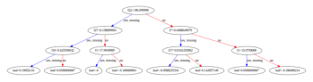
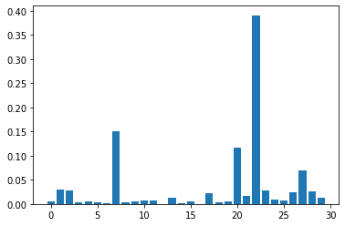
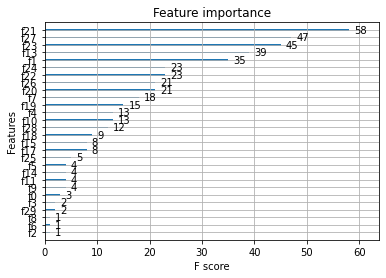
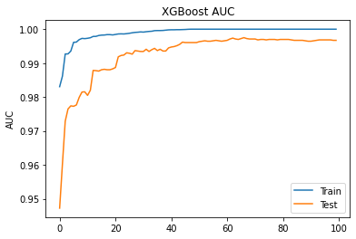
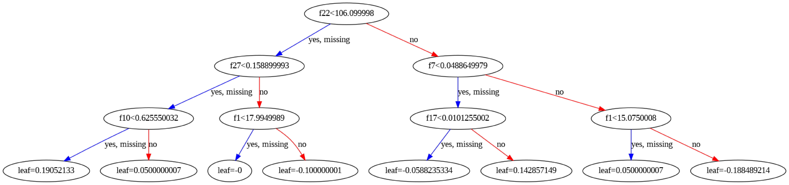

```python
from numpy import loadtxt 
from xgboost import XGBClassifier 
from sklearn.model_selection import train_test_split 
from sklearn.metrics import accuracy_score
from sklearn.datasets import load_breast_cancer
 
# load data
dataset = load_breast_cancer(return_X_y=True)
 
# split data into X and y 
X = dataset[0] 
Y = dataset[1]
 
# tvt split
seed = 7
test_size = 0.33
X_train, X_test, y_train, y_test = train_test_split(X, Y, test_size=test_size, random_state=seed)
eval_set = [(X_train, y_train), (X_test, y_test)]
 
# fit model no training data 
model = XGBClassifier() 
model.fit(X_train, y_train, eval_metric="auc", eval_set=eval_set, verbose=True)
 
print(model)
 
# make predictions for test data 
y_pred = model.predict(X_test) 
predictions = [round(value) for value in y_pred]
 
# evaluate predictions 
accuracy = accuracy_score(y_test, predictions) 
print("Accuracy: %.2f%%" % (accuracy * 100.0))
 
# tree plot
from xgboost import plot_tree
import matplotlib.pyplot as plt
 
plt.figure(figsize=(19, 5))
plot_tree(model)
plt.show()
 
# feature important plot
plt.bar(range(len(model.feature_importances_)), model.feature_importances_)
plt.show()
 
# default plot
from xgboost import plot_importance
plot_importance(model)
plt.show()
 
# evaluation plot
# retrieve performance metrics 
results = model.evals_result()
epochs = len(results['validation_0' ]['auc'])
x_axis = range(0, epochs)
 
fig, ax = plt.subplots()
ax.plot(x_axis, results['validation_0']['auc'], label='Train')
ax.plot(x_axis, results['validation_1']['auc'], label='Test')
ax.legend()
plt.ylabel('AUC')
plt.title('XGBoost AUC')
plt.show()
```

    [0]	validation_0-auc:0.983058	validation_1-auc:0.947247
    [1]	validation_0-auc:0.986154	validation_1-auc:0.960255
    [2]	validation_0-auc:0.99269	validation_1-auc:0.972868
    [3]	validation_0-auc:0.992719	validation_1-auc:0.976481
    [4]	validation_0-auc:0.99355	validation_1-auc:0.977401
    [5]	validation_0-auc:0.99613	validation_1-auc:0.97727
    [6]	validation_0-auc:0.996202	validation_1-auc:0.977664
    [7]	validation_0-auc:0.996918	validation_1-auc:0.979897
    [8]	validation_0-auc:0.997291	validation_1-auc:0.981474
    [9]	validation_0-auc:0.997219	validation_1-auc:0.98154
    [10]	validation_0-auc:0.99732	validation_1-auc:0.980489
    [11]	validation_0-auc:0.997477	validation_1-auc:0.982
    [12]	validation_0-auc:0.997864	validation_1-auc:0.987847
    [13]	validation_0-auc:0.997879	validation_1-auc:0.987781
    [14]	validation_0-auc:0.998137	validation_1-auc:0.987649
    [15]	validation_0-auc:0.998251	validation_1-auc:0.988044
    [16]	validation_0-auc:0.99828	validation_1-auc:0.988175
    [17]	validation_0-auc:0.998395	validation_1-auc:0.988044
    [18]	validation_0-auc:0.998395	validation_1-auc:0.988044
    [19]	validation_0-auc:0.998309	validation_1-auc:0.988306
    [20]	validation_0-auc:0.998452	validation_1-auc:0.988701
    [21]	validation_0-auc:0.998595	validation_1-auc:0.991854
    [22]	validation_0-auc:0.998624	validation_1-auc:0.992248
    [23]	validation_0-auc:0.998595	validation_1-auc:0.992379
    [24]	validation_0-auc:0.998681	validation_1-auc:0.993036
    [25]	validation_0-auc:0.998796	validation_1-auc:0.992905
    [26]	validation_0-auc:0.998939	validation_1-auc:0.992642
    [27]	validation_0-auc:0.999054	validation_1-auc:0.993693
    [28]	validation_0-auc:0.999111	validation_1-auc:0.993562
    [29]	validation_0-auc:0.999197	validation_1-auc:0.993431
    [30]	validation_0-auc:0.99914	validation_1-auc:0.993431
    [31]	validation_0-auc:0.999255	validation_1-auc:0.994088
    [32]	validation_0-auc:0.999341	validation_1-auc:0.993431
    [33]	validation_0-auc:0.999398	validation_1-auc:0.993956
    [34]	validation_0-auc:0.99957	validation_1-auc:0.99435
    [35]	validation_0-auc:0.999599	validation_1-auc:0.993693
    [36]	validation_0-auc:0.999599	validation_1-auc:0.994088
    [37]	validation_0-auc:0.999627	validation_1-auc:0.993562
    [38]	validation_0-auc:0.999713	validation_1-auc:0.993562
    [39]	validation_0-auc:0.999799	validation_1-auc:0.994482
    [40]	validation_0-auc:0.999828	validation_1-auc:0.994744
    [41]	validation_0-auc:0.999828	validation_1-auc:0.994876
    [42]	validation_0-auc:0.999857	validation_1-auc:0.995139
    [43]	validation_0-auc:0.999857	validation_1-auc:0.995533
    [44]	validation_0-auc:0.999885	validation_1-auc:0.99619
    [45]	validation_0-auc:0.999914	validation_1-auc:0.996058
    [46]	validation_0-auc:0.999971	validation_1-auc:0.996058
    [47]	validation_0-auc:1	validation_1-auc:0.996058
    [48]	validation_0-auc:1	validation_1-auc:0.996058
    [49]	validation_0-auc:1	validation_1-auc:0.996058
    [50]	validation_0-auc:1	validation_1-auc:0.996321
    [51]	validation_0-auc:1	validation_1-auc:0.996453
    [52]	validation_0-auc:1	validation_1-auc:0.996584
    [53]	validation_0-auc:1	validation_1-auc:0.996453
    [54]	validation_0-auc:1	validation_1-auc:0.996453
    [55]	validation_0-auc:1	validation_1-auc:0.996584
    [56]	validation_0-auc:1	validation_1-auc:0.996715
    [57]	validation_0-auc:1	validation_1-auc:0.996584
    [58]	validation_0-auc:1	validation_1-auc:0.996453
    [59]	validation_0-auc:1	validation_1-auc:0.996584
    [60]	validation_0-auc:1	validation_1-auc:0.996715
    [61]	validation_0-auc:1	validation_1-auc:0.997109
    [62]	validation_0-auc:1	validation_1-auc:0.997372
    [63]	validation_0-auc:1	validation_1-auc:0.997109
    [64]	validation_0-auc:1	validation_1-auc:0.996978
    [65]	validation_0-auc:1	validation_1-auc:0.997241
    [66]	validation_0-auc:1	validation_1-auc:0.997504
    [67]	validation_0-auc:1	validation_1-auc:0.997241
    [68]	validation_0-auc:1	validation_1-auc:0.997109
    [69]	validation_0-auc:1	validation_1-auc:0.997109
    [70]	validation_0-auc:1	validation_1-auc:0.997109
    [71]	validation_0-auc:1	validation_1-auc:0.996847
    [72]	validation_0-auc:1	validation_1-auc:0.996978
    [73]	validation_0-auc:1	validation_1-auc:0.996978
    [74]	validation_0-auc:1	validation_1-auc:0.996847
    [75]	validation_0-auc:1	validation_1-auc:0.996978
    [76]	validation_0-auc:1	validation_1-auc:0.996978
    [77]	validation_0-auc:1	validation_1-auc:0.996978
    [78]	validation_0-auc:1	validation_1-auc:0.996847
    [79]	validation_0-auc:1	validation_1-auc:0.996978
    [80]	validation_0-auc:1	validation_1-auc:0.996978
    [81]	validation_0-auc:1	validation_1-auc:0.996978
    [82]	validation_0-auc:1	validation_1-auc:0.996978
    [83]	validation_0-auc:1	validation_1-auc:0.996847
    [84]	validation_0-auc:1	validation_1-auc:0.996715
    [85]	validation_0-auc:1	validation_1-auc:0.996715
    [86]	validation_0-auc:1	validation_1-auc:0.996715
    [87]	validation_0-auc:1	validation_1-auc:0.996715
    [88]	validation_0-auc:1	validation_1-auc:0.996584
    [89]	validation_0-auc:1	validation_1-auc:0.996453
    [90]	validation_0-auc:1	validation_1-auc:0.996453
    [91]	validation_0-auc:1	validation_1-auc:0.996584
    [92]	validation_0-auc:1	validation_1-auc:0.996715
    [93]	validation_0-auc:1	validation_1-auc:0.996847
    [94]	validation_0-auc:1	validation_1-auc:0.996847
    [95]	validation_0-auc:1	validation_1-auc:0.996847
    [96]	validation_0-auc:1	validation_1-auc:0.996847
    [97]	validation_0-auc:1	validation_1-auc:0.996847
    [98]	validation_0-auc:1	validation_1-auc:0.996715
    [99]	validation_0-auc:1	validation_1-auc:0.996715
    XGBClassifier()
    Accuracy: 97.87%


    <Figure size 1368x360 with 0 Axes>


    

    


    

    


    

    


    

    


```python
# tree plot
from xgboost import plot_tree
import matplotlib.pyplot as plt
 
plot_tree(model)
fig = plt.gcf()
fig.set_size_inches(150, 100)
fig.savefig('tree.png')
plt.show()
```


    

    


```python

```
