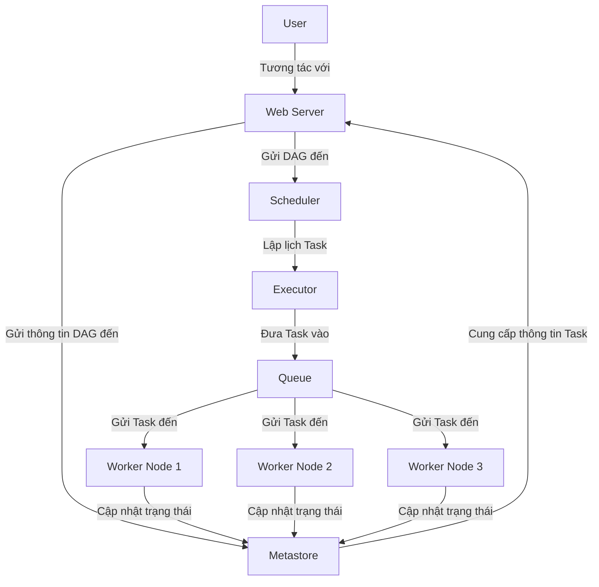

# Airflow Overview

## Overview

Apache Airflow is a powerful workflow orchestration tool that helps you schedule, monitor, and manage data pipelines by **right way, right order and right time**. Since you’re working with feature engineering and GCP, Airflow can be a great addition to automate your ML pipelines.

Nguyên tắc của Airflow:

- Tính năng động ( Dynamic ) : Airflow pipeline được config bằng code Python, cho phép bạn thay đổi code dễ dàng để tùy biến luồng làm việc của bạn.
- Tính tăng trưởng ( Scalable ) : Ví dụ đơn giản là bạn có thể mở rộng các task về xử lý dữ liệu để tiết kiệm thời gian
- Tính gọn gàng ( Elegant ) : code gọn gàng, ngăn nắp, rõ ràng giúp bạn đọc hiểu code nhanh chóng.
- Tính mở rộng ( Extensible ) : Bạn có thể thêm thắt thư viện, modules, packages, ... phù hợp với môi trường của bạn

P/S : Airflow không phải một giải pháp về stream dữ liệu như Spark Streaming, Apache Storm

**1. Core components:**
- *DAGs (Directed Acyclic Graphs)* – Define workflows. (đọc bởi scheduler và executor ( với mọi worker mà executor có ))
- *Tasks & Operators* – Atomic units of execution: những functions sử dụng trong Task or DAGs
	- Action Operators: là function thực hiện 1 nhiệm vụ execute xử lý nào đó
	- Transfer Operator: Transfer data from source to destination
	- Sensor Operator: wait to somethings happen
- *Schedulers* – Manage task execution (chạy workflow , gửi các tasks tới executor)
- *Executors* – Define how tasks run (Local, Celery, Kubernetes, etc.) (quản lý các workers, xử lý các tác vụ đang chạy): difined how to run your task should be executed
- *Worker*: process/sub-processs executing your task
- *Metadata Database* – Stores execution history. (nơi lưu trạng thái của scheduler, executor, webserver)
- *Web UI* – Monitor DAGs visually. (giao diện web cho phép kiểm tra, kích hoạt, sửa lỗi các tasks và DAGs)


**2. Advanced Features**
- *Sensors* (waiting for events like files in GCS).
- *Hooks* (connectors to external services like BigQuery, Pub/Sub).
- *XComs* (passing data between tasks).
- *Branching & Conditional Execution* (BranchPythonOperator).
- *TaskRetries & SLAs* (handling failures).

**3. Writing DAGs**

- How to define DAGs in Python.
- Using **Operators** (BashOperator, PythonOperator, DummyOperator).
- Task dependencies (set_upstream, set_downstream).
- Using Jinja templating for dynamic DAGs.

**4. Airflow with GCP**

- Using **Google Cloud Operators**:
	- **BigQueryOperator** – Querying BigQuery.
	- **DataflowTemplateOperator** – Running Dataflow jobs.
	- **PubSubPublishMessageOperator** – Publishing messages.
	- **KubernetesPodOperator** – Running tasks in GKE.
- Integrating Airflow with **Vertex AI Pipelines**.

**5. Airflow in Production**

- Airflow deployment strategies (Kubernetes, Cloud Composer).
- Monitoring & logging best practices.
- Handling failures & retries.
- Airflow security & authentication.

**6. Real-World Use Cases**

- Automating ML feature engineering pipelines with Airflow.
- ETL/ELT pipelines with Airflow & BigQuery.
- Orchestrating ML training & inference workflows.


## [Airflow Components](https://airflow.apache.org/docs/apache-airflow/stable/core-concepts/overview.html)


### DAG

**Directed Acyclic Graph** là **một đồ thị có hướng không chu trình**, mô tả tất cả các bước xử lý dữ liệu trong một quy trình, từ đó xác định quy trình thực hiện task công việc

- Mỗi DAG được xác định trong 1 file DAG, nó định nghĩa một quy trình xử lý dữ liệu, được biểu diễn dưới dạng một đồ thị có hướng không chu trình, trong đó **các nút là các tác vụ (tasks) và các cạnh là các phụ thuộc giữa các tác vụ**.
- Các tác vụ trong DAG thường được **xử lý tuần tự hoặc song song**
- Khi một DAG được thực thi, nó được gọi là một lần chạy DAG

#### DAG Status


Vòng đời của 1 trạng thái nhiệm vụ gồm có các trạng thái sau
    - **No status**: tác vụ chưa được xếp hàng để thực hiện
    - **Scheduled**: Bộ lập lịch đã xác định rằng các phụ thuộc của nhiệm vụ được đáp ứng và đã lên lịch cho nó chạy
    - **Removed**: Vì một lý do nào đó, tác vụ đã biết mất khỏi DAG kể từ khi bắt đầu chạy
    - **Upstream failed**: tác vụ ngược dòng không thành công
    - **Queued**: Nhiệm vụ đã được giao cho Executor và đang đợi 1 worker có sẵn để thực thi
    - **Running**: Tác vụ đang được chạy bởi một worker
    - **Sucess**: Tác vụ chạy xong không có lỗi
    - **Failed**: Tác vụ có lỗi trong khi thực thi và không chạy được
    - **Up for retry**: Tác vụ không thành công nhưng vẫn còn các lần thử lại và sẽ được lên lịch lại

Vậy lý tưởng nhất cho một tác vụ là gì? Đó là đi từ **No status --> Scheduled --> Queued --> Running --> Sucess**

#### Khai báo DAG

##### Context manager

Với cách này bạn sẽ bọc code của mình trong DAG bằng `with`

```python
from airflow import DAG

with DAG(
    "my_dag_name", start_date=pendulum.datetime(2021, 1, 1, tz="UTC"),
    schedule_interval="@daily", catchup=False
) as dag:
    op = EmptyOperator(task_id="task")

```

##### Standard constructor

Với cách này, bạn sẽ khai báo một constructer gọi tới class DAG

```python
from airflow import DAG

my_dag = DAG("my_dag_name", start_date=pendulum.datetime(2021, 1, 1, tz="UTC"),
             schedule_interval="@daily", catchup=False)
op = EmptyOperator(task_id="task", dag=my_dag)
```

##### Decorator

```python
from airflow.decorators import dag

@dag(start_date=pendulum.datetime(2021, 1, 1, tz="UTC"),
     schedule_interval="@daily", catchup=False)
def generate_dag():
    op = EmptyOperator(task_id="task")

dag = generate_dag()
```

#### VIết DAG

**DAG thực hiện ETL sử dụng decorator + context manager**
```python
import json
import pendulum
from airflow.decorators import dag, task
from airflow.operators.email_operator import EmailOperator

@dag(
    schedule_interval=None, # lịch trình chạy @once, @hourly, @daily...
    start_date=pendulum.datetime(2021, 1, 1, tz="UTC"), # thời gian bắt đầu
    catchup=False, # nếu bạn có `start_date`, `end_date` ( optional ) và `schedule_interval` thì khi bạn để giá trị của catchup là True thì `schedule_interval` sẽ không bị giới hạn và thực thi tasks tức thì.
    tags=['example'],
)
def tutorial_taskflow_api_etl():
    """
    ### TaskFlow API Tutorial Documentation
    This is a simple ETL data pipeline example which demonstrates the use of
    the TaskFlow API using three simple tasks for Extract, Transform, and Load.
    Documentation that goes along with the Airflow TaskFlow API tutorial is
    located
    [here](https://airflow.apache.org/docs/apache-airflow/stable/tutorial_taskflow_api.html)
    """
    @task()
    def extract():
        """
        #### Extract task
        A simple Extract task to get data ready for the rest of the data
        pipeline. In this case, getting data is simulated by reading from a
        hardcoded JSON string.
        """
        data_string = '{"1001": 301.27, "1002": 433.21, "1003": 502.22}'

        order_data_dict = json.loads(data_string)
        return order_data_dict
    @task(multiple_outputs=True)
    def transform(order_data_dict: dict):
        """
        #### Transform task
        A simple Transform task which takes in the collection of order data and
        computes the total order value.
        """
        total_order_value = 0

        for value in order_data_dict.values():
            total_order_value += value

        return {"total_order_value": total_order_value}
    @task()
    def load(total_order_value: float):
        """
        #### Load task
        A simple Load task which takes in the result of the Transform task and
        instead of saving it to end user review, just prints it out.
        """

        print(f"Total order value is: {total_order_value:.2f}")

	email_notification = EmailOperator( 
		task_id='email_notification', 
		to='noreply@xxx.com', 
		subject='dag completed',
		html_content='the dag has finished')

    order_data = extract()
    order_summary = transform(order_data)
    load(order_summary["total_order_value"]) >> email_notification

tutorial_etl_dag = tutorial_taskflow_api_etl()

```

**Import thư viện bổ sung**

Trong trường hợp task của bạn chạy cần một thư viện chỉ định. Chúng ta có thể dùng cách viết Decorator `@task.virtualenv` hoặc cách viết Context Manager `PythonVirtualenvOperator`. Cụ thể như sau:

- Decorator
```python
@task.virtualenv(
        task_id="virtualenv_python", requirements=["numpy"], system_site_packages=False
    )
def mul_number(numbs: list):
        import numpy
        return int(numpy.prod(numpy.array(numbs)))
```

- Context Manager
```python
def mul_number(numbs: list):
        import numpy
        return int(numpy.prod(numpy.array(numbs)))

virtualenv_task = PythonVirtualenvOperator(
    task_id="virtualenv_python",
    python_callable=mul_number(numbs),
    requirements=["numpy"],
    system_site_packages=False,
)
```

P/s: Nếu bạn có nhiều thư viện cần cài thì có thể thêm đường dẫn tới file requirements.txt: `requirements="path\to\requirements.txt"`

#### Optimize DAG Flow

##### Import thư viện trong hàm

Để tối ưu hiệu suất của Airflow, **ta tốt nhất là chỉ viết mã cần thiết để tạo các operator**, **định nghĩa các hàm callable** và **định nghĩa quan hệ giữa chúng**. Điều này là do Airflow sẽ import toàn bộ file định nghĩa DAG trong lúc đọc nội dung nhằm để cập nhật thông tin các DAG, tức là những đoạn code **KHÔNG THUỘC 3 THỨ Ở TRÊN** sẽ được thực thi ngay lập tức và điều đó quá trình xử lý sẽ không đúng kì vọng và tất nhiên quá trình phân tích cú pháp sẽ chậm đi đáng kể

Khi sử dụng numpy, ta nên: 
```python
import pendulum
from airflow import DAG
from airflow.decorators import task

with DAG(
    dag_id="example_python_operator",
    schedule=None,
    start_date=pendulum.datetime(2021, 1, 1, tz="UTC"),
    catchup=False,
    tags=["example"],
) as dag:

    @task()
    def print_array():
        """Print Numpy array."""
        
        import numpy as np  # <- THIS IS HOW NUMPY SHOULD BE IMPORTED IN THIS CASE!a = np.arange(15).reshape(3, 5)
        print(a)
        return a

    print_array()

```

##### Không nên đặt **Airflow Variable** bên ngoài *operator* và *python_callable*

Do các đoạn mã này được thực thi khi lập lịch các task, nên phiên bản của các Variable được sử dụng sẽ là phiên bản tại thời điểm task được lập lịch chứ không phải lúc task được thực thi. Việc đặt chúng ở ngoài như vậy cũng khiến cho hiệu năng giảm sút và quá trình parse các file định nghĩa dag có thể bị timeout

```python
from airflow.models import Variable

# BAD PRACTICE

foo_var = Variable.get("foo")  # DON'T DO THAT
bash_use_variable_bad_1 = BashOperator(
    task_id="bash_use_variable_bad_1", bash_command="echo variable foo=${foo_env}", env={"foo_env": foo_var}
)

bash_use_variable_bad_2 = BashOperator(
    task_id="bash_use_variable_bad_2",
    bash_command=f"echo variable foo=${Variable.get('foo')}",  # DON'T DO THAT
)

bash_use_variable_bad_3 = BashOperator(
    task_id="bash_use_variable_bad_3",
    bash_command="echo variable foo=${foo_env}",
    env={"foo_env": Variable.get("foo")},  # DON'T DO THAT
)

# GOOD PRACTICE

bash_use_variable_good = BashOperator(
    task_id="bash_use_variable_good",
    bash_command="echo variable foo=$**{foo_env}**",
    env={"foo_env": "{{ var.value.get('foo') }}"},
)

@task
def my_task():
    var = Variable.get("foo")  # this is fine, because func my_task called only run task, not scan DAGs.
    print(var)

```

##### Giảm độ phức tạp của DAG

Nếu bạn muốn tối ưu hóa DAG của mình, đây là một số điều bạn có thể làm:
- **Làm cho DAG của bạn tải nhanh hơn**: Thông thường việc kiểm tra quá trình load một dag có thể thực hiện qua câu lệnh chẳng hạn như sau `time python airflow/example_dag.py` kết quả sẽ cho thông tin về việc Airflow cần bao lâu để đọc được nội dung DAG đã được cài đặt. Đôi khi mã tối ưu và không tối ưu chỉ chênh nhau vài trăm mili giây, tuy nhiên nếu số lượng DAG tăng lên theo thời gian thì đây lại là vấn đề lớn đấy.
- **Làm cho DAG của bạn tạo ra một cấu trúc đơn giản hơn**: Rất rõ ràng ta có thể thấy rằng DAG có cấu trúc tuyến tính đơn giản `A-> B-> C` sẽ mất ít thời gian hơn trong quá trình lập lịch cũng như thực thi. Điều đó lại hoàn toàn ngược lại với một DAG có cấu trúc cây sâu với số lượng công việc phụ thuộc tăng theo cấp số nhân.
- **Có số lượng DAG nhỏ hơn trên mỗi file cài đặt**: Trong khi Airflow 2 được tối ưu hóa cho trường hợp có nhiều DAG trong một tệp, có một số phần của hệ thống làm cho nó ít hiệu quả hoặc gây ra nhiều sự chậm trễ hơn so với việc có những **DAG đó chia thành nhiều tệp**. Vậy nên, nếu bạn có nhiều DAG được tạo ra từ một tệp, hãy xem xét chia chúng nếu bạn quan sát thấy nó mất nhiều thời gian để phản ánh các thay đổi trong tệp DAG của bạn trong giao diện người dùng của Airflow.
- **Don't repeat yourself**: Thông thường ta sẽ có một hoặc một vài phần mã được sử dụng chung trong toàn bộ các DAG. Tất nhiên là nếu số lần lặp lại ít thì cũng chẳng làm sao cả, tuy nhiên tốt hơn hết ta nên tách chúng thành các Operator riêng biệt. Điều này sẽ giúp ta (1) quản lý source code dễ hơn, (2) kiểm thử tốt hơn, (3) tránh lặp code và hạn chế các vấn đề phát sinh trong quá trình phát triển
#### Action to DAG

##### Mount thư các thư mục cần thiết vào container

Trong docker-compose.yaml, các câu lệnh sau dùng để amount các thư mục trong airflow folder vào container

```yaml

  volumes: # mount the whole project directory to the container

    - ${AIRFLOW_PROJ_DIR:-.}/dags:/opt/airflow/dags
    - ${AIRFLOW_PROJ_DIR:-.}/logs:/opt/airflow/logs
    - ${AIRFLOW_PROJ_DIR:-.}/config:/opt/airflow/config
    - ${AIRFLOW_PROJ_DIR:-.}/plugins:/opt/airflow/plugins

```

##### Check DAG Syntax (Before Running)

```sh
docker-compose exec airflow-webserver airflow dags list
```
- If there are any issues, fix them before proceeding.

For detail if there are any error when import DAG to Airflow:
```sh
docker-compose exec airflow-webserver airflow dags list-import-errors
```

##### Test DAG Locally

To verify that your DAG is correct

```sh
docker-compose exec airflow-webserver airflow dags test my_new_dag 2024-02-17
```
- This runs the DAG for a **specific execution date**.
- It does **not** depend on the scheduler.

##### Debug Specific Task Execution
If a specific task is failing, you can debug it by running:
```sh
docker-compose exec airflow-webserver airflow tasks test my_new_dag my_task_id 2024-02-17
```
- This runs only **one task** in the DAG at a specific execution date.

##### Refresh DAG in Airflow UI
If you modify the DAG and need to refresh it:
```sh
# Option 1: Restart Webserver & Scheduler
docker-compose restart airflow-webserver airflow-scheduler

# OR Clear DAG and Reload
docker-compose exec airflow-webserver airflow dags reserialize
```
##### View Logs for Debugging
If a DAG fails or doesn’t appear in the UI, check logs:
```sh
docker-compose logs airflow-webserver
docker-compose logs airflow-scheduler

# To see logs for a specific task execution:
docker-compose exec airflow-webserver airflow tasks logs my_new_dag my_task_id 2024-02-17
```
##### Delete & Restart DAG (If Necessary)

```sh
docker-compose exec airflow-webserver airflow dags delete my_new_dag
```
Or, clear all task instances:
```sh
docker-compose exec airflow-webserver airflow tasks clear my_new_dag --dag-run-state=queued
```

##### Stop & Restart Airflow (If Needed)
If changes are not reflecting:
```sh
docker-compose down 
docker-compose up -d
```

To completely reset Airflow (including database):
```sh
docker-compose down --volumes 
docker-compose up -d
```


**Refresh lại WebUI để cập nhật trạng thái mới nhất**.
Nếu bạn kiểm tra airflow database sẽ thấy thông tin file DAG đã được lưu lại. Dùng airflow shell script để kiểm tra

```python
./airflow.sh dags list
```


**Check DAG trên WebUI**

Ban đầu DAG `test_operator` trong trạng thái tạm dừng, chúng ta cần kích hoạt nó, sau đó trigger DAG nằm trong mục Actions ở ảnh trên. Mục Runs sẽ thống kê trạng thái của các lần chạy DAG, như ở bên trên thì tôi có 1 lần thành công và 8 lần thất bại ( do chạy thử để sửa code ). Ngoài ra bạn có thể click vào tên file DAG để xem chi tiết ( kiến trúc, ngày giờ chạy, thời gian chạy của mỗi task, ... )

**Chỉnh sửa DAG**: Cứ thực hiện chỉnh sửa trong thư mục đã amount (ko cần phải build lại container), dags_script sẽ tự động được update cho lần chạy tiếp theo

**Xoá DAG**

P/s: Nếu các bạn muốn xóa file DAG trên web thì làm theo các bước sau:

3. Xóa file DAG trong thư mục `dags/`
4. Dùng câu lệnh `./airflow.sh dags delete DAG_ID` - DAG_ID ở đây là tên file DAG, ví dụ "test_operator" để xóa bản ghi trong cơ sở dữ liệu hoặc dùng câu lệnh `/airflow.sh db reset`
5. Trên Web UI, ấn vào icon thùng rác @@ trong mục Actions

#### Test/Debug DAG

Test kiểm tra xem DAG có load được lên airflow hay không ?
- B1: chạy `python đường_dẫn_tới_tệp_DAG_của_bạn.py`: đảm bảo rằng DAG của bạn không chứa bất kỳ phụ thuộc chưa được cài đặt, lỗi cú pháp
- B2: chạy `time python airflow/example_dag.py` (Linux) để tính số thời gian để load run DAG,  so sánh kết quả trước và sau tối ưu hóa
- B3: Viết pytest:

**Check: tất cả các DAG được cài đặt có được load thành công hay không**
```python
def get_import_errors():
    dag_bag = DagBag(include_examples=False)
    def strip_path_prefix(path):
        return os.path.relpath(path, os.environ.get("AIRFLOW_HOME"))
    return [(None, None)] + [
        (strip_path_prefix(k), v.strip()) for k, v in dag_bag.import_errors.items()
    ]

@pytest.mark.parametrize(
    "rel_path,rv", get_import_errors(), ids=[x[0] for x in get_import_errors()]
)
def test_file_imports(rel_path, rv):
    if rel_path and rv:
        raise Exception(f"{rel_path} failed to import with message \n {rv}")

```

**Check xem DAG có được khởi tạo đúng cách hay không**
```python
import pytest
from airflow.models import DagBag


@pytest.fixture()
def dagbag():
    return DagBag()


def test_dag_loaded(dagbag):
    dag = dagbag.get_dag(dag_id="hello_world")
    assert dagbag.import_errors == {}
    assert dag is not None 
		assert len(dag.tasks) == 1


```

**Check xem cấu trúc DAG có giống như kì vọng hay không**
```python
def assert_dag_dict_equal(source, dag):
    assert dag.task_dict.keys() == source.keys()
    for task_id, downstream_list in source.items():
        assert dag.has_task(task_id)
        task = dag.get_task(task_id)
        assert task.downstream_task_ids == set(downstream_list)


def test_dag():
    assert_dag_dict_equal(
        {
            "DummyInstruction_0": ["DummyInstruction_1"],
            "DummyInstruction_1": ["DummyInstruction_2"],
            "DummyInstruction_2": ["DummyInstruction_3"],
            "DummyInstruction_3": [],
        },
        dag,
    )
```

**Check xem Custom Operator**
```python
import datetimeimport pendulumimport pytestfrom airflow import DAG
from airflow.utils.state import DagRunState, TaskInstanceState
from airflow.utils.types import DagRunType

DATA_INTERVAL_START = pendulum.datetime(2021, 9, 13, tz="UTC")
DATA_INTERVAL_END = DATA_INTERVAL_START + datetime.timedelta(days=1)

TEST_DAG_ID = "my_custom_operator_dag"
TEST_TASK_ID = "my_custom_operator_task"


@pytest.fixture()
def dag():
    with DAG(
        dag_id=TEST_DAG_ID,
        schedule="@daily",
        start_date=DATA_INTERVAL_START,
    ) as dag:
        MyCustomOperator(
            task_id=TEST_TASK_ID,
            prefix="s3://bucket/some/prefix",
        )
    return dag


def test_my_custom_operator_execute_no_trigger(dag):
    dagrun = dag.create_dagrun(
        state=DagRunState.RUNNING,
        execution_date=DATA_INTERVAL_START,
        data_interval=(DATA_INTERVAL_START, DATA_INTERVAL_END),
        start_date=DATA_INTERVAL_END,
        run_type=DagRunType.MANUAL,
    )
    ti = dagrun.get_task_instance(task_id=TEST_TASK_ID)
    ti.task = dag.get_task(task_id=TEST_TASK_ID)
    ti.run(ignore_ti_state=True)
    assert ti.state == TaskInstanceState.SUCCESS

```

Nói chung là việc kiểm thử với Airflow khá là mất thời gian, nhất là khi các Operator thường tương tác với các dịch vụ bên ngoài, nếu không phải các loại database, S3 các thứ thì cũng là Slack để gửi report chẳng hạn. Trong những lúc này các bạn sẽ cần nhiều thứ hơn ví dụ như [mock](https://docs.python.org/dev/library/unittest.mock.html) các function để giả lập các chức năng chẳng hạn, dễ dàng test function hơn khi viết các hàm xử lý trong các custom operator thay vì là các `python_callable` riêng lẻ.
#### Xử lý Python Packages phức tạp, xung đột

##### Sử dụng `PythonVirtualenvOperator`

`PythonVirtualenvOperator` cho phép bạn tạo động một `virtualenv` mà chức năng gọi Python của bạn sẽ thực thi. Mỗi task có thể có một `virtualenv` Python độc lập (được tạo động mỗi lần nhiệm vụ được chạy) và có thể chỉ định tập yêu cầu chi tiết cần phải được cài đặt cho nhiệm vụ đó để thực thi.

**Operator sẽ chịu trách nhiệm:**

- Tạo virtualenv dựa trên môi trường của bạn
- Serializing hàm xử lý và chuyển nó cho trình thông dịch Python của `virtualenv` để thực thi
- Thực thi và lấy kết quả của chức năng gọi và đẩy nó qua Xcom nếu được chỉ định

**Các lợi ích của operator này là:**

- Không cần phải chuẩn bị venv trước. Nó sẽ được tạo động trước khi nhiệm vụ được chạy và bị xóa sau khi hoàn tất.
- Bạn có thể chạy nhiều task với các nhiều bộ `dependencies` khác nhau trên cùng một worker, do đó tài nguyên bộ nhớ được tái sử dụng.

**Tuy nhiên, có những giới hạn và chi phí phát sinh bởi operator này:**

- Bởi vì hàm xử lý sẽ được serialize trước khi được thực thi nên chúng có thể sẽ có một số thay đổi không đáng có
- Operator thêm chi phí CPU, mạng và thời gian xử lý để chạy mỗi task vì chúng sẽ luôn tạo lại venv cũng cài đặt các thư viện cần có mỗi khi bắt đầu và xóa đi sau khi hoàn tất quá trình thực thi
- Các worker cần truy cập PyPI hoặc các kho lưu trữ riêng để cài đặt các `dependencies`.
- Việc tạo động `virtualenv` có thể dễ bị lỗi tạm thời.

##### Sử dụng `DockerOperator` hoặc `Kubernetes Pod Operator`

`DockerOperator` và `KubernetesPodOperator` sẽ yêu cầu Airflow có quyền truy cập vào một Docker Engine hoặc cụm Kubernetes chạy các task trong các container tùy chỉnh, và điều đó sẽ có một số đặc điểm như sau:

**Các lợi ích của việc sử dụng các operator này là:**

- Bạn có thể chạy các task với các tập `dependencies` khác nhau của cả Python và cả các `dependencies` cấp hệ thống hoặc thậm chí là các task được viết bằng ngôn ngữ hoàn toàn khác nhau hoặc kiến trúc bộ xử lý khác nhau.
- Môi trường được sử dụng để chạy các nhiệm vụ được tận dụng các tối ưu hóa và sẽ luôn không thay đổi do bản chất của các container.
- Hoàn toàn đảm bảo được tính cô lập giữa các task cũng như các lần chạy khác nhau

**Những điểm hạn chế:**

- Bạn cần hiểu rõ hơn về cách thức hoạt động của Docker Containers hoặc Kubernetes.
- Khó test ở dưới local, do bạn khó có thể dựng một môi trường Kubernetes tương tự trên production để sử dụng
- Việc thực thi trong các container thường có một chi phí phát sinh, chủ yếu là liên quan đến việc giao tiếp với Docker Engine hoặc cụm Kubernetes. Và bên cạnh đó bạn cũng sẽ cần chuẩn bị trước một image chứa toàn bộ môi trường thực thi cũng như lưu trữ nó trên một registry để nó sẵn sàng được tải về khi cần.
### Task

https://airflow.apache.org/docs/apache-airflow/stable/core-concepts/tasks.html

**Task** là một đơn vị cơ bản để thực hiện một công việc nhỏ (**được định nghĩa bởi Developer**) trong quy trình xử lý dữ liệu. Mỗi Task là một bước trong quy trình và có thể được lập lịch thực hiện tùy theo các điều kiện cụ thể.

Một **Task** trong Airflow có các thuộc tính và phương thức sau:
- **`task_id`**: định danh duy nhất của task trong DAG.
- **`owner`**: người sở hữu task.
- **`depends_on_past`**: xác định liệu task hiện tại có phụ thuộc vào kết quả của task trước đó hay không.
- **`retries`**: số lần thử lại nếu task thất bại.
- **`retry_delay`**: khoảng thời gian giữa các lần thử lại.
- **`start_date`**: thời điểm bắt đầu thực hiện task.
- **`end_date`**: thời điểm kết thúc thực hiện task.
- **`execution_timeout`**: thời gian tối đa cho phép để thực hiện task.
- **`on_failure_callback`**: hàm được gọi khi task thất bại.
- **`on_success_callback`**: hàm được gọi khi task thành công.

Có 3 nhóm cơ bản về task:
- *Operator*: predefined task templates that you can string together quickly to build most parts of your DAGs.
- *Sensor*:  special subclass of Operators which are entirely about waiting for an external event to happen.
- *TaskFlow*: decorated `@task`, which is a custom Python function packaged up as a Task.

#### Xác định thứ tự xử lý của các tasks

- Cách 1: dùng toán tử `<<` và `>>`

```python
first_task >> [second_task, third_task]
third_task << fourth_task
```

- Cách 2: dùng hàm `set_downstream` và `set_upstream`

```python
first_task.set_downstream(second_task, third_task)
third_task.set_upstream(fourth_task)
```

Trường hợp các tasks giao nhau

```python
from airflow.models.baseoperator import cross_downstream

# Replaces
# [op1, op2] >> op3
# [op1, op2] >> op4
cross_downstream([op1, op2], [op3, op4])
```

Trường hợp các tasks tạo thành dây chuyền

```python
from airflow.models.baseoperator import chain

#1
# op1 >> op2 >> op3 >> op4
chain(op1, op2, op3, op4)

#2
# op1 >> op2 >> op3 >> op4 >> op5 >> op6
chain(*[EmptyOperator(task_id='op' + i) for i in range(1, 6)])

#3
# op1 >> op2 >> op4 >> op6
# op1 >> op3 >> op5 >> op6
chain(op1, [op2, op3], [op4, op5], op6)
```
### Operator

https://airflow.apache.org/docs/apache-airflow/stable/core-concepts/operators.html


Mỗi operator đại diện cho một công việc cụ thể (**được định nghĩa trước bởi Airflow**) trong quy trình, ví dụ như đọc dữ liệu từ một nguồn dữ liệu, xử lý dữ liệu, hoặc ghi dữ liệu vào một nguồn dữ liệu khác.

Các operator trong Airflow được phân loại thành các loại chính sau
- **BashOperator**: Chạy các lệnh Bash hoặc script Shell.
- **PythonOperator**: Thực thi các hàm Python.
- **EmailOperator**: Gửi email thông qua SMTP.
- **DummyOperator**: Được sử dụng để tạo các kết nối giữa các task.
- **PythonVirtualenvOperator**: Thực thi các hàm Python trong một môi trường ảo.
- **MySqlOperator**: Thực hiện các lệnh SQL trên cơ sở dữ liệu MySQL.
- **PostgresOperator**: Thực hiện các lệnh SQL trên cơ sở dữ liệu PostgreSQL.
- **S3FileTransformOperator**: Thực hiện các chức năng xử lý file trên Amazon S3.
- **SparkSqlOperator**: Thực hiện các truy vấn Spark SQL.
- **HdfsSensor**: Kiểm tra sự tồn tại của một tệp trên Hadoop Distributed File System (HDFS).

> Ví dụ: đọc dữ liệu từ một tệp CSV, xử lý dữ liệu và lưu kết quả vào một cơ sở dữ liệu PostgreSQL:
- **FileSensor**: Kiểm tra sự tồn tại của tệp CSV trên hệ thống tệp.
- **BashOperator**: Sử dụng lệnh Bash để di chuyển tệp CSV đến thư mục xử lý.
- **PythonOperator**: Thực hiện các xử lý dữ liệu, ví dụ như đọc tệp CSV và chuyển đổi dữ liệu thành định dạng phù hợp để lưu vào cơ sở dữ liệu.
- **PostgresOperator**: Thực hiện các lệnh SQL để lưu kết quả xử lý vào PostgreSQL.
- **EmailOperator**: Gửi email thông báo cho người dùng khi quy trình xử lý dữ liệu hoàn thành.

### Sensor

Sensor là một loại Operator được sử dụng để **giám sát** các sự kiện và điều kiện, và thực hiện các hành động tương ứng. Sensor thường được sử dụng để **đợi cho đến khi một điều kiện nào đó xảy ra trước khi tiếp tục thực hiện** quy trình.

Các loại Sensor trong Airflow bao gồm:
- **FileSensor**: Kiểm tra sự tồn tại của một tệp trên hệ thống tệp.
- **TimeSensor**: Đợi cho đến khi một khoảng thời gian cụ thể đã trôi qua.
- **HttpSensor**: Kiểm tra sự phản hồi của một URL cụ thể.
- **HdfsSensor**: Kiểm tra sự tồn tại của một tệp trên Hadoop Distributed File System (HDFS).
- **SqlSensor**: Kiểm tra sự tồn tại của một bảng hoặc một số dòng dữ liệu trong cơ sở dữ liệu.
- **S3KeySensor**: Kiểm tra sự tồn tại của một đối tượng trên Amazon S3.
- **ExternalTaskSensor**: Kiểm tra trạng thái của một task khác trong DAG.

Sensor sẽ giữ cho task đang chạy và thử lại sau một khoảng thời gian cụ thể, giúp đảm bảo rằng không có dữ liệu bị mất hoặc xử lý sai.

## Aiflow Workflow

Không giống như các công cụ Dữ liệu lớn như Apache Kafka, Apache Storm, Apache Spark,hoặc Flink, **Apache Airflow** không phải là giải pháp truyền dữ liệu. Nó chủ yếu là một trình quản lý quy trình làm việc


Hình vẽ trên tổng quan về các thành phần cơ bản của Apache Airflow.

- **Scheduler**: giám sát tất cả các DAG và các tác vụ được liên kết của chúng. Đối với 1 task, khi các phụ thuộc được đáp ứng, Scheduler sẽ khởi tạo tác vụ đó. Nó kiểm tra các tác vụ đang hoạt động để bắt đầu theo định kỳ: `scheduler` lấy các `task` chưa được thực thi hoặc được thực thi lại ra để xử lý
- **Executor**: xử lý việc chạy các task này bằng cách đưa chúng cho worker để chạy:
	- Đến lúc này, một `TaskInstance` sẽ được tạo ra nhằm mục đích chứa trạng thái của quá trình thực thi task cũng như các thông tin khác, chẳng hạn như context của nó.
	- Tiếp đó Airflow cho phép user **render các giá trị tại thời điểm task instance được tạo thông qua Jinja templating**, vậy nên bạn có thể tham khảo cách sử dụng chúng để code ngắn hơn tại [đây](https://airflow.apache.org/docs/apache-airflow/stable/templates-ref.html)
	- Quá trình thực thi bằng một CeleryExecutor như biểu đồ. Ta sẽ có hai tiến trình được khởi tạo, và đó là `RawTaskProcess`(thực thi các mã nguồn được định nghĩa bởi người dùng) và `LocalTaskJobProcess`(theo dõi RawTaskProcess)
	
	
- **Web server**: giao diện người dùng của Airflow, hiện thị trạng thái của nhiệm vụ và cho phép người dùng tương tác với cơ sở dữ liệu cũng như đọc tệp nhật kỹ từ kho lưu trữ từ xa như Google Cloud Storage, S3, ...
- **DAG Directory**: một thư mục chứa các file DAG của các quy trình xử lý dữ liệu (data pipelines) trong Airflow.
- **Metabase Database**: được sử dụng bởi Scheduler, Executor và Web Server để lưu trữ thông tin quan trọng của từng DAG, ví dụ như các phiên bản, số liệu thống kê mỗi lần chạy, khoảng thời gian lên lịch, ...

### Luồng đi của Multi-Nodes Architecture

Airflow sử dụng **Celery Executor** trong mô hình **Multi Nodes Architecture**, giúp phân tán và xử lý các tác vụ (tasks) trên nhiều worker nodes. Dưới đây là luồng đi của Airflow trong kiến trúc này:


**Người dùng tương tác với Web Server**

- Người dùng truy cập **Web Server** trên **Node 1** để tạo, sửa đổi, hoặc chạy DAGs (Directed Acyclic Graphs).
- Web Server gửi thông tin DAG đến **Metastore** trên **Node 2**, nơi lưu trữ thông tin về DAGs, Task Instances và Logs.

**Scheduler lập lịch và gửi tác vụ đến Executor**

- **Scheduler** trên **Node 1** đọc thông tin từ **Metastore** và quyết định tác vụ nào cần chạy.
- Scheduler gửi tác vụ đến **Executor**.

**Executor đưa tác vụ vào hàng đợi (Queue)**

- Executor sử dụng **Queue** (có thể là Redis hoặc RabbitMQ) để lưu các tác vụ chờ thực thi.
- Hàng đợi đóng vai trò trung gian, giúp phân phối nhiệm vụ đến các worker.

**Workers nhận tác vụ và thực thi**

- Các **Worker Nodes** (Worker Node 1, 2, 3) liên tục lấy công việc từ **Queue** và thực hiện chúng.
- Mỗi **Worker Node** chạy một hoặc nhiều **Airflow Workers**, xử lý các tác vụ theo DAG.

**Kết quả được cập nhật về Metastore**

- Sau khi hoàn thành, worker gửi trạng thái của task (thành công/thất bại) trở lại **Metastore** trên **Node 2**.
- Người dùng có thể kiểm tra trạng thái trên **Web Server**.

**Tóm tắt lại quy trình Airflow (Celery Executor)**
2. Người dùng tạo DAG trên **Web Server**.
3. Scheduler lên lịch và đẩy task vào **Queue**.
4. Các **Workers** lấy task từ hàng đợi và xử lý chúng.
5. Trạng thái task được cập nhật trong **Metastore**.
6. Người dùng có thể xem trạng thái trên **Web Server**.
## Installation & Setup

### Installation

Có nhiều cách setup airflow ([xem thêm](https://airflow.apache.org/docs/apache-airflow/stable/installation/index.html)):
- [Using released sources](https://airflow.apache.org/docs/apache-airflow/stable/installation/index.html#using-released-sources)
- [Using PyPI](https://airflow.apache.org/docs/apache-airflow/stable/installation/index.html#using-pypi)
- [Using Production Docker Images](https://airflow.apache.org/docs/apache-airflow/stable/installation/index.html#using-production-docker-images)
- [Using Official Airflow Helm Chart](https://airflow.apache.org/docs/apache-airflow/stable/installation/index.html#using-official-airflow-helm-chart)
- [Using Managed Airflow Services](https://airflow.apache.org/docs/apache-airflow/stable/installation/index.html#using-managed-airflow-services)
- [Using 3rd-party images, charts, deployments](https://airflow.apache.org/docs/apache-airflow/stable/installation/index.html#using-3rd-party-images-charts-deployments)
- [Notes about minimum requirements](https://airflow.apache.org/docs/apache-airflow/stable/installation/index.html#notes-about-minimum-requirements)

Chúng ta sẽ thực hiện setup airflow bằng docker-compose:
**1. Setup docker-compose**
```bash
sudo curl -L "https://github.com/docker/compose/releases/download/v2.9.0/docker-compose-$(uname -s)-$(uname -m)" -o /usr/local/bin/docker-compose

sudo chmod +x /usr/local/bin/docker-compose

docker-compose --version

```
**2. Setup Airflow docker-compose file**
```
curl -LfO 'https://airflow.apache.org/docs/apache-airflow/lastest/docker-compose.yaml'

# chỉnh sửa docker-compose file cho phù hợp
```

Trong file yaml này đã có chứa các services sẵn:

- **airflow-scheduler**: giám sát các tasks cũng như chạy tasks khi đã có đủ dependencies
- **airflow-webserver**: webserver có local domain `http://localhost:8080`
- **airflow-worker**: các worker chạy các tasks theo lệnh của scheduler
- **airflow-init**: dịch vụ khởi tạo ban đầu ( tạo account, migrate database, ... )
- **postgres**: cơ sở dữ liệu
- **redis**: cầu nối truyền dẫn các lệnh từ scheduler tới worker.

P/S: Nếu bạn muốn cài thêm một số thư viện python hoặc nâng cấp airflow providers thì có thể điều chỉnh file `docker-compose.yaml` mà bạn vừa tải về bên trên.

- Do thư mục DAG sẽ được mount vào trong các container (chi tiết vui lòng xem trong file [docker-compose.yaml](https://airflow.apache.org/docs/apache-airflow/2.6.0/docker-compose.yaml) ) vậy nên ta cần điều chỉnh một chút thông qua việc đặt biến môi trường `AIRFLOW_UID` để tránh các vấn đề liên quan đến quyền có thể phát sinh, nhất là với các file trong thư mục DAG

**3. Khởi tạo môi trường**
Trước khi chạy Airflow lần đầu, bạn cần phải chuẩn bị môi trường chút: tạo files, folders cần thiết, khởi tạo cơ sở dữ liệu
```bash
mkdir -p ./dags ./logs ./plugins
echo -e "AIRFLOW_UID=$(id -u)" > .env
```
- `./dags` : nơi chứa files DAG
- `./logs` : nơi chứa log của executor và scheduler
- `./plugins` : nơi chứa các plugin tùy chỉnh của bạn
> Ở một số hệ điều hành, nếu không set biến `AIRFLOW_UID` sẽ hiện lên cảnh báo, bạn có thể phớt lờ chúng đi. Thay vào đó, bạn có thể tạo 1 file `.env` trong cùng folder file `docker-compose.yaml` với nội dung `AIRFLOW_UID=50000`

**4. Khởi chạy**

```bash
# Khởi tạo cơ sở dữ liệu và tài khoản trước
docker-compose up airflow-init

# check instance
docker ps -a

# run airflow
docker-compose up

# bạn cũng có thể xóa container và image nếu thử nghiệm xong cho tránh nặng máy
docker-compose down --volumes --rmi all

# Hoặc chỉ xóa mỗi container
docker-compose down --volumes --remove-orphans

```

Truy cập **Web Interface**: `http://localhost:8080` 
- Tài khoản / mật khẩu mặc định: `airflow` / `airflow`
> 	sửa tài khoản và pass trong biến tại file docker-compose.yaml : `_AIRFLOW_WWW_USER_USERNAME` , `_AIRFLOW_WWW_USER_PASSWORD`
- Nếu bạn không muốn WebUI chứa các file DAG mẫu mà nhà phát triển cung cấp thì có thể thay đổi env `AIRFLOW__CORE__LOAD_EXAMPLES: 'false'` trong file `docker-compose.yaml`

### Cài đặt packages
Các thành phần của airflow sẽ sử dụng chung một docker image. Vậy nên trong trường hợp cần tùy chỉnh hoặc cài đặt thêm các dependencies, cách tốt nhất với docker-compose được viết sẵn kia sẽ là build trước một custom image và để tên của nó vào file `.env`. Trong trường hợp bạn muốn test nhanh một thư viện nào đó, `PythonVirtualenvOperator` sẽ là lựa chọn thích hợp

Khi bạn sử dụng **Docker Compose** để chạy Apache Airflow, tất cả các thành phần như **Scheduler, Webserver, Worker, Triggerer, Flower** đều sử dụng chung một **Docker image** do Airflow cung cấp (thường có tên `apache/airflow`). Điều này có nghĩa là:

- Nếu bạn muốn cài thêm **thư viện Python hoặc package hệ thống**, bạn cần cập nhật image này, thay vì cài đặt riêng lẻ trên từng thành phần.
- Nếu chỉ sửa một thành phần, những thành phần khác vẫn bị ảnh hưởng vì tất cả đều dùng chung image.

#### 🟢 Cách tốt nhất: Build một **custom image**

Với Docker Compose, cách tối ưu nhất để cài đặt thêm thư viện hoặc thay đổi cài đặt là:

7. **Tạo một Dockerfile** để mở rộng image gốc của Airflow.
8. **Cài đặt thêm thư viện, dependencies vào image mới**.
9. **Cập nhật file `.env` để sử dụng image này** thay vì image gốc.

🔹 **Ví dụ** về `Dockerfile` để thêm thư viện `pandas` và `requests`:

Dockerfile tuỳ chỉnh
```dockerfile
# Use the official Apache Airflow image as the base
FROM apache/airflow:2.10.5

# Switch to the root user to install OS-level packages
USER root

# Install OS-level packages
RUN apt-get update \
    && apt-get install -y --no-install-recommends \
       vim \
    && apt-get autoremove -yqq --purge \
    && apt-get clean \
    && rm -rf /var/lib/apt/lists/*

# Switch back to the airflow user
USER airflow

# Install Python packages
COPY requirements.txt .
RUN pip install --no-cache-dir -r requirements.txt
```

**Build and Tag the Docker Image:** Navigate to the directory containing your `Dockerfile` and execute the build command:
```bash
docker build . --pull --tag my-airflow-image:latest
```
--> builds the image and tags it as `my-airflow-image:latest`

**Update Your Docker Compose Configuration:** If you're using Docker Compose, modify your `docker-compose.yaml` to use your custom image:

```yaml
version: '3'
services:
  airflow:
    image: my-airflow-image:latest
    # ... other configurations ...

```

#### 🟢 Thử nghiệm nhanh với thư viện mới:

Nếu bạn chỉ muốn thử nghiệm nhanh một thư viện trong một tác vụ cụ thể mà không muốn tạo lại Docker image, bạn có thể sử dụng `PythonVirtualenvOperator`. Operator này cho phép tạo một môi trường ảo Python riêng biệt trong quá trình chạy tác vụ, nơi bạn có thể cài đặt các thư viện mà không ảnh hưởng đến môi trường chung của Airflow.

```python
from airflow import DAG
from airflow.operators.python import PythonVirtualenvOperator
from datetime import datetime

def test_pandas():
    import pandas as pd
    df = pd.DataFrame({"A": [1, 2, 3]})
    print(df)

with DAG("test_virtualenv", start_date=datetime(2025, 1, 1), schedule_interval=None) as dag:
    run_task = PythonVirtualenvOperator(
        task_id="install_and_run_pandas",
        python_callable=test_pandas,
        requirements=["pandas"],  # Thư viện cần cài đặt trong virtualenv
        system_site_packages=False
    )

    run_task

```

- **Không cần build lại Docker image:** Tiết kiệm thời gian và công sức khi chỉ cần thử nghiệm nhanh.
- **Không ảnh hưởng đến các thành phần khác:** Môi trường ảo được tạo riêng cho từng tác vụ, đảm bảo tính độc lập.
- **Dễ dàng thử nghiệm các thư viện mới:** Nhanh chóng kiểm tra tính tương thích và hiệu quả của thư viện trước khi tích hợp chính thức.

### Deployment

- For cloud/airflow service:  [Amazon Managed Workflows for Apache Airflow (MWAA)](https://aws.amazon.com/managed-workflows-for-apache-airflow/) hay [Google Cloud Composer](https://cloud.google.com/composer) và [Azure Data Factory Managed Airflow](https://learn.microsoft.com/azure/data-factory/concept-managed-airflow)
- Hoặc sử dụng **k8s**

Sử dụng Kubernetes cho Airflow:
- Sử dụng một số chart được viết sẵn và chỉnh sửa thêm, check chart: https://github.com/airflow-helm/charts
- Đồng bộ phiên bản DAG như thế nào ?  Thông thường thì không phải DAG cứ code phát là xong luôn mà ta sẽ cần chỉnh sửa chúng qua các phiên bản khác nhau. Vậy làm thế nào để ta có thể tự động cập nhật phiên bản DAG mỗi khi chúng được thay đổi? Giải pháp mình (và đa số) chọn là sử dụng git-sync sidecar. Việc sử dụng nó đơn giản sẽ là ta tạo thêm một container chạy song song với container chính, có nhiệm vụ theo dõi một repo Git và cập nhật mọi thay đổi từ đó. Chi tiết thì mọi người có thể đọc thêm tại [https://github.com/kubernetes/git-sync](https://github.com/kubernetes/git-sync)
- **PodDisruptionBudget**: Vì đang triển khai trên K8s nên tất nhiên ta sẽ cần quan tâm đến một số khái niệm của nó nữa. PodDisruptionBudget thường được sử dụng để quản lý số gián đoạn có thể có, khá là thích hợp khi các bạn có một nhóm các Worker và ta cần đảm bảo số lượng tối thiểu worker đang hoạt động. Về chi tiết cách sử dụng thì bạn có thể xem thêm tại [https://kubernetes.io/docs/tasks/run-application/configure-pdb/](https://kubernetes.io/docs/tasks/run-application/configure-pdb/)

#### Triển khai Airflow trên k8s

#### Triển khai Airflow trên Google Composer

### Cấu hình biến môi trường

Cấu hình thông qua các biến môi trường là cần thiết để đảm bảo quá trình cài đặt và triển khai hầu hết các hệ thống (https://12factor.net/vi/config)

Với Airflow, ta sẽ có hai khái niệm để sử dụng, bao gồm Variable và Connection.

#### Variable

Đầu tiên là **Variable**, đây là khái niệm runtime configuration của Airflow, được lưu trữ theo từng cặp key/value và có thể được sử dụng toàn cục tại tất cả các vị trí. Việc sử dụng các Airflow Variable có thể thực hiên theo hai cách như sau:

- Lấy ra dữ liệu từ phương thức `get`

```python
from airflow.modelsimport Variable

# Normal call style
foo = Variable.get("foo")

# Auto-deserializes a JSON value
bar = Variable.get("bar", deserialize_json=True)

# Returns the value of default_var (None) if the variable is not set
baz = Variable.get("baz", default_var=None)
```

- Hoặc render ra thông qua các marco nếu như bạn đang không sử dụng các `PythonOperator`

```bash
# Raw value
echo {{ var.value.<variable_name> }}

# Auto-deserialize JSON value
echo {{ var.json.<variable_name> }}
```

Vậy ta có thể đặt giá trị cũng quản lý chúng như thế nào? Cách đơn giản nhất sẽ là thông qua WebUI và Airflow có sẵn một tab trên trang webserver để ta quản lý các Variable. Trang này có giao diện như sau:


Đôi khi ta sẽ muốn đặt sẵn các Variable thông qua các biến môi trường, chẳng hạn như lúc deploy. Khi đó, Airflow sẽ đọc các Variable từ các biến môi trường được bắt đầu bằng tiền tố `AIRFLOW_VAR_` chẳng hạn như sau:

```bash
export AIRFLOW_VAR_FOO=BAR

# To use JSON, store them as JSON strings
export AIRFLOW_VAR_FOO_BAZ='{"hello":"world"}'
```

Tiếp đó, thông thường các thông tin để truy cập đến các dịch vụ khác sẽ gồm từ ba đến 5 trường chẳng hạn như `AWS S3` sẽ yêu cầu `AWS Access Key ID**,`** `AWS Secret Access Key`**,** `Region Name`, … và có thể còn nhiều hơn nữa. Vậy nên thay vì đặt chúng ở các Variable riêng biệt, Airflow cho phép chúng ta nhóm chúng thành một Connecton và chúng ta có thể truyền id của chúng vào các Operator tương ứng để sử dụng, chẳng hạn như với `SlackConnection` `slack_conn` vaf `SnowFlake Connection snowflake_conn` được sử dụng trong `SnowflakeToSlackOperator`như sau:

```python
from airflow.decorators import dag
from pendulum import datetime
from airflow.providers.snowflake.transfers.snowflake_to_slack import (
    SnowflakeToSlackOperator,
)

@dag(start_date=datetime(2022, 7, 1), schedule=None, catchup=False)
def snowflake_to_slack_dag():
    transfer_task = SnowflakeToSlackOperator(
        task_id="transfer_task",
        # the two connections are passed to the operator here:
        snowflake_conn_id="snowflake_conn",
        slack_conn_id="slack_conn",
        params={"table_name": "ORDERS", "col_to_sum": "O_TOTALPRICE"},
        sql="""
            SELECT
              COUNT(*) AS row_count,
              SUM({{ params.col_to_sum }}) AS sum_price
            FROM {{ params.table_name }}
        """,
        slack_message="""The table {{ params.table_name }} has
            => {{ results_df.ROW_COUNT[0] }} entries
            => with a total price of {{results_df.SUM_PRICE[0]}}""",
    )

    transfer_task

snowflake_to_slack_dag()
```

#### Connection

Việc quản lý các **Connection** cũng khá giống với Variable khi ta có thể để Airflow đọc chúng thông qua các biến môi trường có tiền tố là `AIRFLOW_CONN_` hoặc quản lý thông qua WebUI như dưới đây


## Airflow Command

### Quản lý Docker

- **Hiển thị các container Docker đang chạy:**  `docker ps`

- **Thực thi lệnh `/bin/bash` trong container có `container_id` để mở một phiên shell:** `docker exec -it container_id /bin/bash`
  
### Quản lý thư mục và đường dẫn

- **Hiển thị đường dẫn hiện tại bạn đang đứng:** `pwd`

- **Hiển thị danh sách các file và thư mục trong thư mục hiện tại:** `ls`
### Quản lý cơ sở dữ liệu của Airflow

- **Khởi tạo metadatabase:** `airflow db init`

- **Khởi tạo lại metadatabase (xóa tất cả dữ liệu):** `airflow db reset`

- **Nâng cấp metadatabase (áp dụng schema và giá trị mới nhất):** `airflow db upgrade`

### Khởi động các thành phần của Airflow

- **Khởi động webserver của Airflow:** `airflow webserver`

- **Khởi động scheduler của Airflow:** `airflow scheduler`

- **Khởi động một Celery worker (hữu ích trong chế độ phân tán để phân chia nhiệm vụ giữa các máy/nút):** `airflow celery worker`

### Quản lý DAGs

- **Liệt kê danh sách các DAG đã biết (bao gồm các DAG trong thư mục `examples` hoặc `dags`):** `airflow dags list`

- **Kích hoạt DAG `example_python_operator` với ngày hiện tại làm execution date:** `airflow dags trigger example_python_operator`

- **Kích hoạt DAG `example_python_operator` với một ngày trong quá khứ làm execution date (Lưu ý: Lệnh này sẽ không kích hoạt các task của DAG nếu không đặt tùy chọn `catchup=True` trong định nghĩa DAG):**  
  `airflow dags trigger example_python_operator -e 2021-01-01`

- **Kích hoạt DAG `example_python_operator` với một ngày trong tương lai (điều chỉnh sao cho có thêm khoảng 2 phút so với ngày hiện tại hiển thị trong giao diện Airflow UI). DAG sẽ được lên lịch chạy vào ngày đó:**  
  `airflow dags trigger example_python_operator -e '2021-01-01 19:04:00+00:00'`

- **Hiển thị lịch sử các lần chạy của DAG `example_python_operator`:** `airflow dags list-runs -d example_python_operator`

### Quản lý Tasks

- **Liệt kê các task có trong DAG `example_python_operator`:** `airflow tasks list example_python_operator`

- **Kiểm thử task `print_the_context` của DAG `example_python_operator` cho ngày `2021-01-01` mà không cần quan tâm đến dependencies hoặc các lần chạy trước đó (Hữu ích cho việc debug):**  
  `airflow tasks test example_python_operator print_the_context 2021-01-01`
